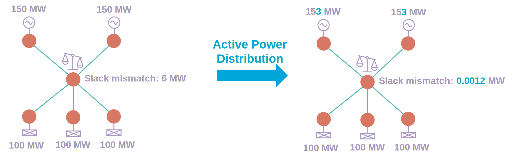

# Outer loops detailed description

## Active Power Distribution

Active power distribution aims at reducing active power mismatch at the slack bus to get a balanced network.

The way the active power distribution is performed is simulated by answering these three questions:
- **Where is the imbalance ?**  This is determined by the slack bus choice (see [parameter `slackBusSelectionMode`](../loadflow/parameters.md#slackbusselectionmode)). The imbalance can also be shared
by multiple slack buses (see [parameter `maxSlackBusCount`](../loadflow/parameters.md#maxslackbuscount))
- **Who participates to reduce the imbalance ?** These can be either generators or loads depending on the balance type and the network description (active power control extension
can be used to specify which elements participate to the active power distribution)
- **How the imbalance is distributed ?** Some of the elements can contribute more than other (depending on their technology). Several ways of describing participation coefficient can be configured or specified (see [parameter `balanceType`](inv:powsyblcore:*:*:#param-lf-balance-type))

## Area Interchange Control

Area Interchange Control consists in having the Load Flow finding a solution where area interchanges are solved to match the input target interchange values. It is supported for both AC and DC Load Flow computations.

The area interchange control feature is optional, can be activated via the [parameter `areaInterchangeControl`](../loadflow/parameters.md#areainterchangecontrol)
and is performed by an outer loop.

Area Interchange Control is performed using an outer loop, similar in principle to the traditional `SlackDistribution` outer loop.
However unlike the `SlackDistribution` outer loop which distributes imbalance over the entire synchronous component (island),
the Area Interchange Control outer loop performs an active power distribution over areas
(filtered on areas having their type matching the configured [parameter `areaInterchangeControlAreaType`](../loadflow/parameters.md#areainterchangecontrolareatype)),
in order to have all areas' active power interchanges matching their target interchanges.

The Area Interchange Control outer loop can handle networks where part (or even all) of the buses are not in an area.
For networks that have no areas at all, the behaviour is the same as with the distributed slack outer loop - in such case
internally the Area Interchange Control outer loop just triggers the Slack Distribution outer loop logic.

Just like other outer loops, the Area Interchange Control outer loop checks whether area imbalance must be distributed:
* If no, the outer loop is stable
* If yes, the outer loop is unstable and a new Newton-Raphson is triggered

### Area Interchange Control - algorithm description

The active power is distributed separately on injections (as configured in the [parameter `balanceType`](inv:powsyblcore:*:*:#param-lf-balance-type)) of each area
to compensate the area "total mismatch" that is given by:

$$
Area Total Mismatch = Interchange - Interchange Target + Slack Injection
$$

Where: 
* "Interchange" is the sum of the power flows at the boundaries of the area (load sign convention i.e. counted positive for imports). 
* "Interchange Target" is the interchange target parameter of the area. 
* "Slack Injection" is the active power mismatch of the slack bus(es) present in the area (see [Slack bus mismatch attribution](#slack-bus-mismatch-attribution)).

The outer loop iterates until the absolute value of this mismatch is below the configured [parameter `areaInterchangePMaxMismatch`](../loadflow/parameters.md#areainterchangepmaxmismatch) for all areas.

When it is the case, "interchange only" mismatch is computed for all areas:

$$
Interchange Mismatch = Interchange - Interchange Target
$$

If the absolute value of this mismatch is below the [parameter `areaInterchangePMaxMismatch`](../loadflow/parameters.md#areainterchangepmaxmismatch) for all areas and the absolute value of slack bus active power mismatch is below the [parameter `slackBusPMaxMismatch`](../loadflow/parameters.md#slackbuspmaxmismatch), then the outer loop declares a stable status, meaning that the interchanges are correct and the slack bus active power is distributed.

If not, the remaining slack bus mismatch is first distributed over the buses that have no area.

If some slack bus mismatch still remains, it is distributed over all the areas (see [Remaining slack bus mismatch distribution](#remaining-slack-bus-mismatch-distribution)).

### Areas validation
There are some cases where areas are considered invalid and will not be considered for the area interchange control:
- Areas without interchange target
- Areas without boundaries
- Areas that have boundaries in multiple synchronous/connected components. If all the boundaries are in the same component but some buses are in different components, only the part in the component of the boundaries will be considered.

In such cases the involved areas are not considered in the Area Interchange Control outer loop, however other valid areas will still be considered.

### Interchange flow calculation

In IIDM each area defines the boundary points to be considered in the interchange. IIDM supports two ways of modeling area boundaries:
- either via an equipment terminal,
- or via a BoundaryLine boundary.

In the BoundaryLine case, the flow at the boundary side is considered as it should be, for both unpaired BoundaryLines and BoundaryLines paired in a TieLine.

### Slack bus mismatch attribution
Depending on the location of the slack bus(es), the role of distributing the active power mismatch will be attributed based on the following logic:
- If the slack bus is part of an area: the slack power is attributed to the area (see "total mismatch" calculation in [Algorithm description](#area-interchange-control---algorithm-description)).
  Indeed, in this case the slack injection can be seen as an interchange to 'the void' which must be resolved.
- Slack bus has no area:
    - Connected to other bus(es) without area: treated as the slack mismatch of the buses without area
    - Connected to only buses that have an area:
        - All connected branches are boundaries of those areas: Not attributed to anyone, the mismatch will already be present in the interchange mismatch
        - Some connected branches are not declared as boundaries of the areas: Amount of mismatch to distribute is split equally among the areas (added to their "total mismatch")

### Remaining slack bus mismatch distribution
This section covers the case where the "total mismatch" of all areas is in [-`areaInterchangePMaxMismatch`;`areaInterchangePMaxMismatch`], but some slack bus active power mismatch remains (even after trying to distribute on buses with no area).
This remaining slack bus active power mismatch will be distributed by all areas, each one will get a share of this mismatch to distribute.

This distribution will affect each area's interchange and will not necessarily make it closer to its target.
The distribution factor of each area will be computed in a way that minimizes chances of having the area increase its interchange mismatch up to more than [`areaInterchangePMaxMismatch`](../loadflow/parameters.md#areainterchangepmaxmismatch) in absolute value. 
So the factor is proportional to the "margin" of active power that the area can distribute while keeping $-areaInterchangePMaxMismatch < Area Total Mismatch < areaInterchangePMaxMismatch$. 

It is computed like this: 
$Factor = sign(Slack Bus Mismatch) * Area Total Mismatch + areaInterchangePMaxMismatch $ 
Then factors are normalized to have sum of factors equal to 1.

The distribution is iterative (inside the same outer loop iteration).
Each area distributes its share, if some areas cannot fully distribute it, they are excluded from this distribution and the remaining slack is distributed among other areas at next iteration.
The distribution iterates until all the mismatch has been distributed and fails if all areas cannot distribute anymore but some mismatch remains.

### Zero impedance boundary branches
The following applies when the [`lowImpedanceBranchMode`](../loadflow/parameters.md#lowimpedancebranchmode) is set to `REPLACE_BY_ZERO_IMPEDANCE_LINE`.
Currently, computations involving zero-impedance branches used as boundary branches are not supported.
However, it is still possible to submit network models that include zero-impedance boundary branches. 
If a terminal of a zero-impedance branch is designated as a boundary, Open LoadFlow will internally assign the branch
an impedance value equal to the [`lowImpedanceThreshold`](../loadflow/parameters.md#lowimpedancethreshold) parameter.
