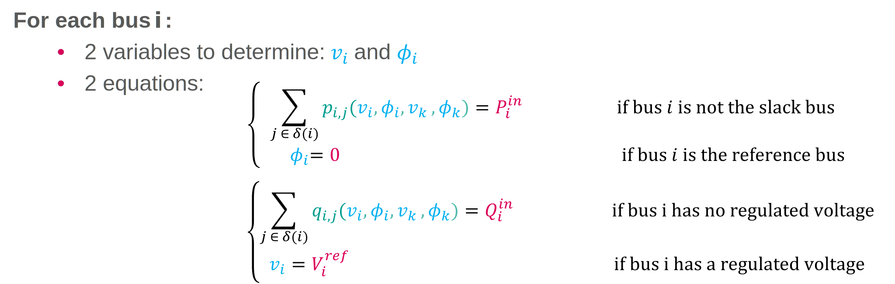
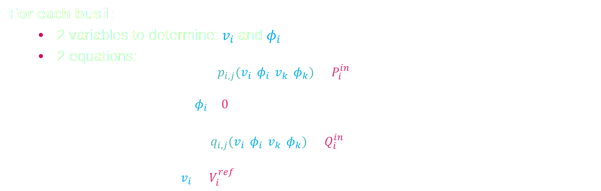
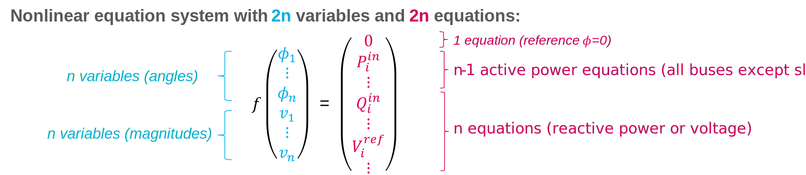
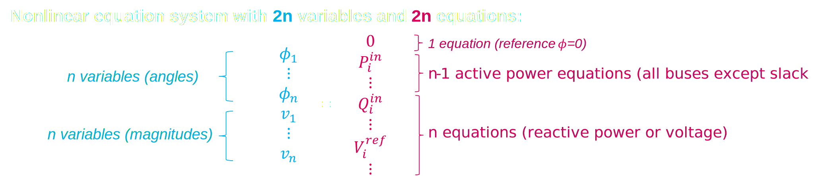
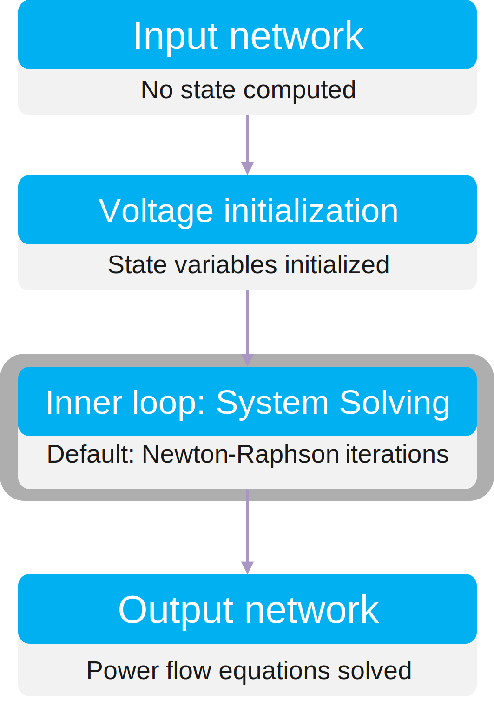
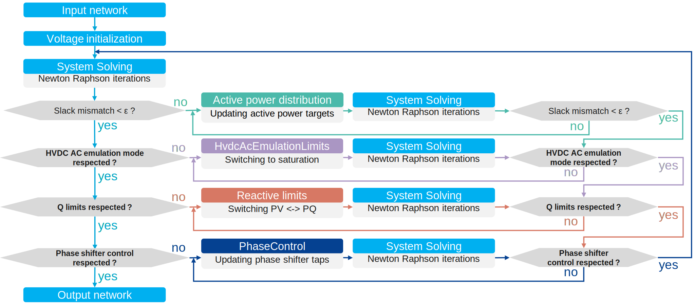

# Load flow theory

## Main goal

The main goal of Open Load Flow is to compute a steady state of the network given as input that ensures :
- Kirschhoff laws are respected (junction rule and loop rule)
- Frequency control is respected (the grid is balanced with power generation being equal to power consumption and losses)
- Voltage control is respected (voltage targets are reached with respect of reactive limits)
- Regulations that have impact on the steady state have been simulated (ratio tap changing, phase tap changing, AC emulation, etc.)

To get to these conditions, the input network is modeled in bus/view topology (only composed of buses and branches). The load flow mainly has to compute state variables (in AC mode, they are voltage magnitudes $v_i$ and phase angles $\phi_i$ at each bus $i$).
From this estimation of the state variables, branch equations (detailed in [Grid modeling chapter](#grid-modeling)) let us compute active power flows ($P_ij$ and $P_ji$), reactive power flows ($Q_ij$ and $Q_ji$) at each branch connecting bus $i$ to bus $j$.
From these power flows, power injection $P_i$ and $Q_i$ at each bus $i$ can be computed.

## Inner loops: Solving the equation system

### Equation System Definition

The core calculation of the load flow relies on solving an equation system. In AC load flow, this equation system is defined by target values for each bus $i$ that can be:
- Voltage magnitude: $V_i$
- Phase angle: $\Phi_i$
- Active power injection: $P_i$
- Reactive power injection: $Q_i$

A bus can be defined by its type depending on the targets that are known (usually two for each bus), for example:
- PQ bus type for buses where active power and reactive power injections are known (active power target and reactive power target are defined)
- PV bus type for buses where active power injection and voltage are known (bus with voltage regulating components which have voltage target)
- ΦV bus type for buses where angle and reactive power injection (reference and slack bus with voltage regulation)
- ...

A bus $i$ can also be defined by two equations implying all the branches that are connected to it:
{class="only-light"}
{class="only-dark"}

More details about the equations used are given in [Grid modeling chapter](#grid-modeling).

At the end, the number of unknows and equations leads to a complete nonlinear equation system:
{class="only-light"}
{class="only-dark"}

**Note:** For a DC load flow, the same principle is applied but there are only n linear equations (only active power equations) and n variables (only phase angles).

### Equation system solving

In case of DC equation system, the system is linear and the equation can be instantly solved. On the opposite, the AC equation system is nonlinear, and by default it is solved by the Newton Raphson method that computes
iteratively derivative of the equation function to get close to the solution. In this case, state variables should be initialized to compute iteratively the solution.

We now have defined how the main core of the load flow works with the inner loops (by default Newton-Raphson iterations) to solve the equation system.

{width=50%}

To simulate all the regulations, the load flow will tweak the equations through outer loops.

## Outer loops: Tweaking the equation system

Outer loops are defined in a way regulations can be hierarchized. After having solved a first time the equation system, the first outer loop checks a condition (e.g. is the active power balanced or is there a mismatch at the slack bus ?),
and if the condition is not respected, the equation system is modified (e.g. if unbalanced, generators active power targets are modified). The inner loops are applied again to check the solution of the new equation system, and
the outer loop condition is checked again until stabilization. If stabilized, then the second outer loop is checked, and so on.

For example, these outer loops are usually executed in a load flow: 

If all the outer loops are stabilized, the load flow computation is done, and the result is given as output.

